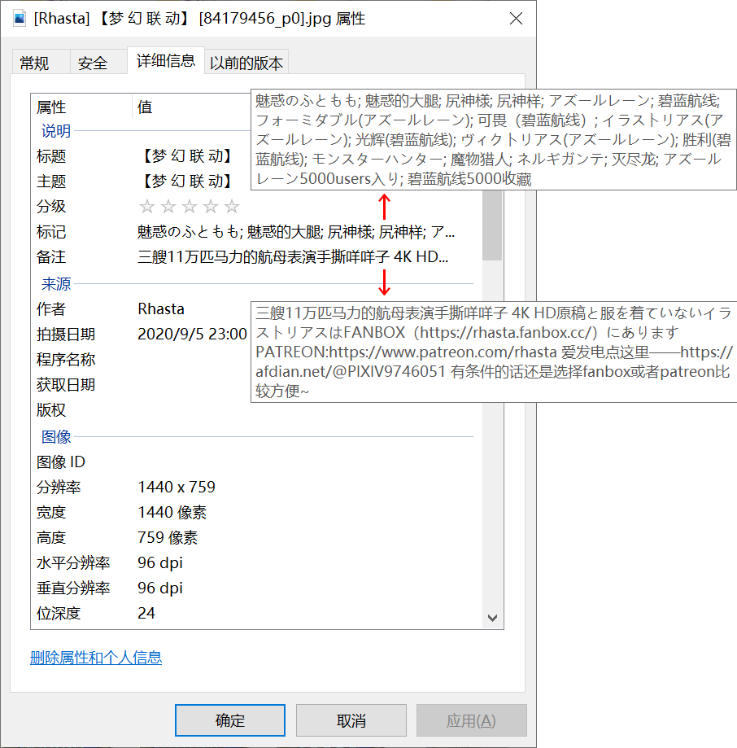

# PixivMeta

把pixiv作品信息作为元数据（标签）写入图片

在Windows下可以通过标签直接搜索

### 有哪些功能

- 重命名，格式如 [Anmi] 鵜飼い [44873217_p0].jpg
- 写入元数据
  - 标题 
  - 画师名
  - 日期时间（上传时间）
  - 关键字（作品标签，包含日文原文和中文翻译）
  - 作品介绍
- 以JPEG编码方式保存

### 截图

- 软件界面

- 文件属性

- Windows搜索

### 要注意什么

- 原文件会删除
- 文件必须以“44873217_p0.jpg”的格式命名
- 仅支持jpg和png文件
- png文件会以JPEG编码方式保存，但会复制原文件到“\png”文件夹下

